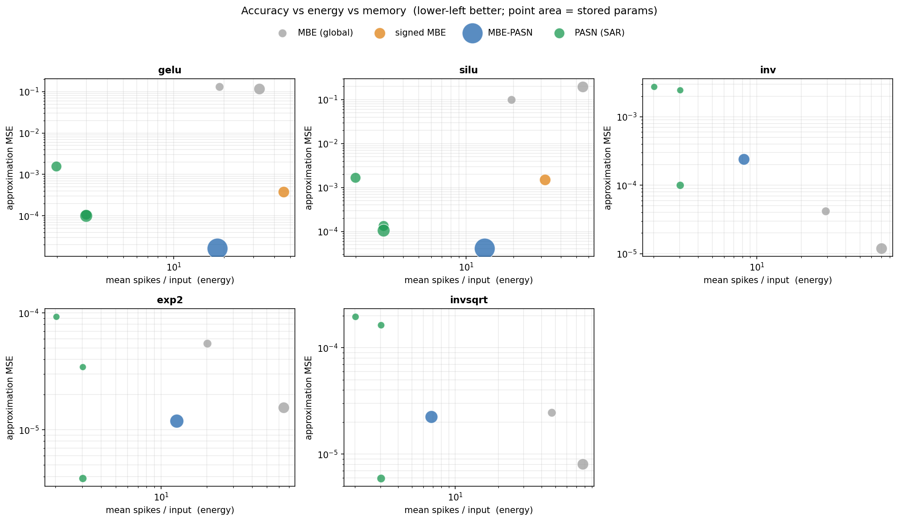

# Neuron comparison report — MBE vs MBE‑PASN vs PASN

**What this is.** A three‑way comparison of the neurons on 1‑D function
approximation (the building block of the whole conversion framework), measured on
three axes that matter for an SNN: **accuracy** (approximation MSE), **energy**
(mean spikes per input), and **memory** (stored parameters).

Reproduce:
```bash
python experiments/compare_neurons.py --json results/neuron_compare.json
python experiments/plot_neurons.py results/neuron_compare.json results/neuron_compare.png
```
(SNN env, CPU, T=16 for MBE/MBE‑PASN, T∈{4,6} bits for PASN.)



*Figure: per function, MSE (y, log) vs spikes/input (x, log); point area = stored
parameters. Lower‑left and smaller = better on all three axes. Green (PASN) sits at
the far left (fewest spikes) with small points (least memory).*

---

## The three neurons

| neuron | what it is | dynamics | learned by |
|---|---|---|---|
| **MBE** | one global multi‑basis neuron (signed = polarity split, the strongest MBE‑family baseline for GELU/SiLU) | learned exponential‑decay kernels | surrogate‑gradient + closed‑form readout |
| **MBE‑PASN** | prefix binade banks of **MBE** neurons (the MBE‑improvement variant) | learned exp‑decay per bank | same, per bank |
| **PASN** | standalone: prefix routing → fixed **successive‑approximation (SAR)** spike code → per‑bank linear/low‑order readout | fixed SAR (no learned dynamics) | closed‑form least squares only |

---

## Headline (best config per neuron)

Best accuracy‑oriented config of each neuron, per function — **MSE / spikes / params**:

| function | MBE (global) | MBE‑PASN | **PASN (SAR)** |
|---|---|---|---|
| **gelu**    | 3.8e‑4 / 46 / 49 (signed) | 1.7e‑5 / 18 / 181 | **1.0e‑4 / 3.0 / 63** |
| **silu**    | 1.5e‑3 / 32 / 49 (signed) | 4.2e‑5 / 13 / 181 | **1.1e‑4 / 3.0 / 63** |
| **inv**     | 1.2e‑5 / 70 / 49 | 2.4e‑4 / 8 / 51 | **1.0e‑4 / 3.0 / 21** |
| **exp2**    | 1.6e‑5 / 64 / 49 | 1.2e‑5 / 13 / 77 | **3.9e‑6 / 3.0 / 21** |
| **invsqrt** | 8.0e‑6 / 77 / 49 | 2.3e‑5 / 7 / 64 | **6.0e‑6 / 3.0 / 24** |

**Reading:**
- **Energy.** PASN uses **~3 spikes/input on every function** — roughly **7–25× fewer**
  than MBE (20–77) and **2–6× fewer** than MBE‑PASN (7–18). Spikes are the SNN
  energy currency, so this is the main win.
- **Memory.** PASN stores only per‑bank readout coefficients: **14–63 params**,
  vs MBE‑PASN's **51–181** (learned dynamics per bank). Comparable to a single
  global MBE, far below MBE‑PASN.
- **Accuracy.** On the **smooth** functions (exp2, invsqrt) PASN is **Pareto‑dominant** —
  best MSE *and* fewest spikes *and* least memory. On **inv** it matches within ~8×
  of the best MBE at **23× fewer spikes**. On **gelu/silu**, MBE‑PASN reaches a
  slightly lower MSE (~2–4e‑5) but at **6× the spikes and 3× the memory**; PASN holds
  ~1e‑4 — well past the point where a global MBE fails (~1e‑1).

---

## Full results

### gelu  (domain −8…8)
| model | MSE | spikes/in | params |
|---|---|---|---|
| MBE N=4 | 1.32e‑1 | 18.8 | 25 |
| MBE N=8 | 1.18e‑1 | 32.6 | 49 |
| SignedMBE 4×2 | 3.79e‑4 | 45.5 | 49 |
| MBE‑PASN nloc=2 | **1.65e‑5** | 18.2 | 181 |
| PASN T=4 o=1 | 1.58e‑3 | **1.98** | 42 |
| PASN T=6 o=1 | 1.09e‑4 | 2.99 | 42 |
| PASN T=6 o=2 | 9.96e‑5 | 2.99 | 63 |

### silu  (domain −8…8)
| model | MSE | spikes/in | params |
|---|---|---|---|
| MBE N=8 | 1.97e‑1 | 54.8 | 49 |
| SignedMBE 4×2 | 1.51e‑3 | 31.7 | 49 |
| MBE‑PASN nloc=2 | **4.15e‑5** | 13.1 | 181 |
| PASN T=6 o=1 | 1.33e‑4 | 2.99 | 42 |
| PASN T=6 o=2 | 1.05e‑4 | 2.99 | 63 |

### inv  (domain 0.5…1)
| model | MSE | spikes/in | params |
|---|---|---|---|
| MBE N=8 | **1.20e‑5** | 70.1 | 49 |
| MBE‑PASN nloc=2 | 2.39e‑4 | 8.2 | 51 |
| PASN T=6 o=1 | 2.47e‑3 | 3.01 | 14 |
| PASN T=6 o=2 | 9.98e‑5 | 3.01 | 21 |

### exp2  (domain 0…1)
| model | MSE | spikes/in | params |
|---|---|---|---|
| MBE N=8 | 1.55e‑5 | 64.5 | 49 |
| MBE‑PASN nloc=2 | 1.19e‑5 | 12.6 | 77 |
| PASN T=6 o=2 | **3.87e‑6** | **3.03** | 21 |

### invsqrt  (domain 0.5…2)
| model | MSE | spikes/in | params |
|---|---|---|---|
| MBE N=8 | 8.04e‑6 | 77.3 | 49 |
| MBE‑PASN nloc=2 | 2.25e‑5 | 6.8 | 64 |
| PASN T=6 o=2 | **5.95e‑6** | **3.04** | 24 |

---

## Takeaways

1. **PASN trades a little peak accuracy on the hardest curved functions (GELU/SiLU)
   for a large, uniform energy and memory saving.** Where the target is smooth
   (exp2, invsqrt, and inv with an order‑2 readout) it dominates on all three axes.
2. **PASN is training‑free in the strong sense** — no surrogate‑gradient fitting of
   any spike dynamics, only a closed‑form least‑squares readout. It builds in
   milliseconds; MBE / MBE‑PASN need gradient + LBFGS epochs.
3. **Order matters cheaply.** Going from an order‑1 (piecewise‑linear) to an order‑2
   readout drops PASN's MSE ~1 order of magnitude at the **same** spike budget (the
   extra cost is a few more stored coefficients, not more spikes).
4. **Honest caveats.** MSE and spikes here are measured on a **uniform** test
   distribution over each domain; the real per‑layer distribution in a network is
   concentrated near zero (where PASN's binades are densest, so this if anything
   understates PASN's in‑context edge). Bit‑budget is fixed per neuron here;
   per‑binade adaptive budgets (fewer bits in flat binades) would lower PASN's spikes
   further.

## Next
- Adaptive per‑binade bit budget for PASN (cut spikes below ~3).
- Wire PASN into the GPT‑2 conversion and compare its conversion loss against the
  MBE paper's published table, alongside MBE‑PASN.
